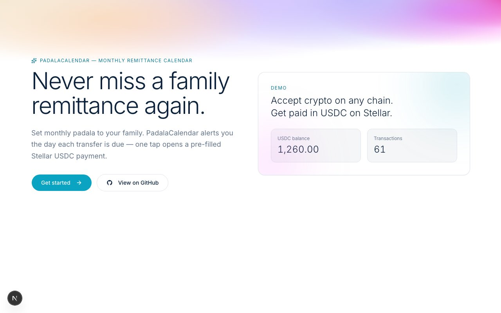
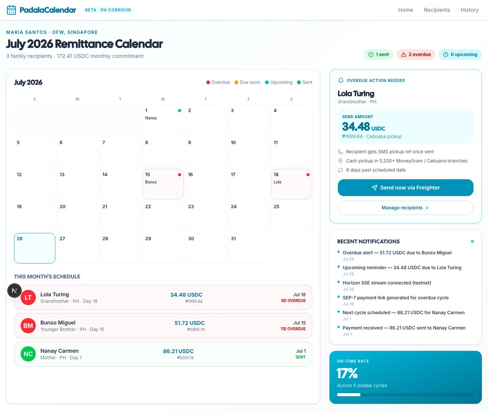
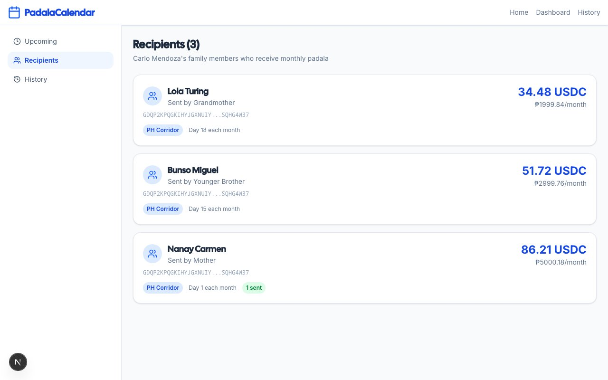
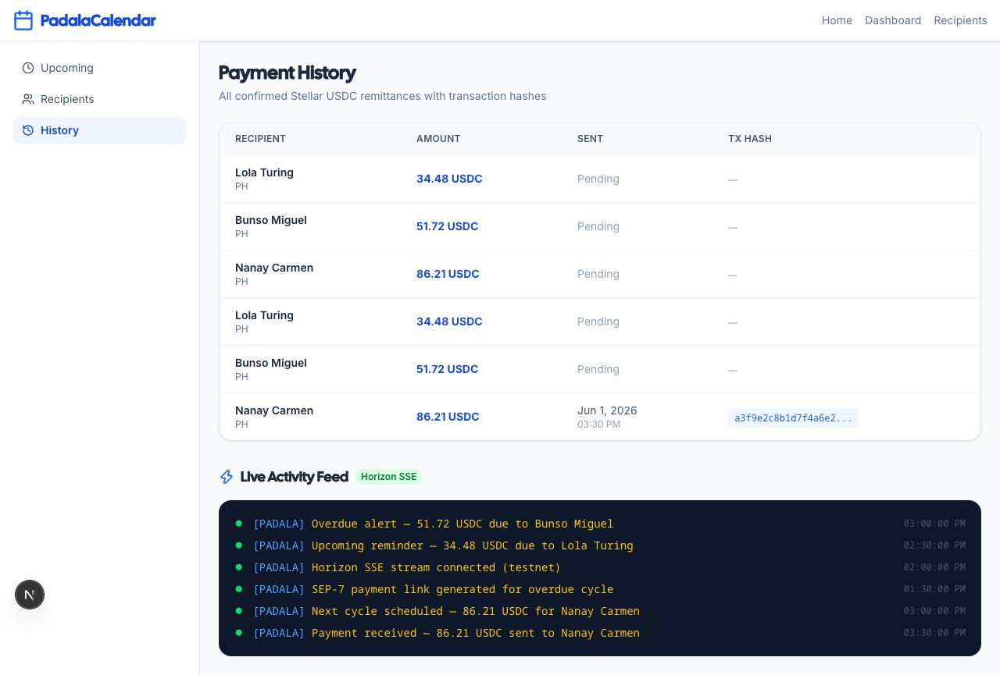
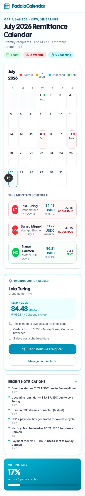

# PadalaCalendar — Remittance Calendar

PadalaCalendar is a lightweight hackathon demo for scheduled family remittances from Singapore to the Philippines. It combines a monthly calendar, overdue reminders, SEP-7 payment links and a live activity feed.

- Live demo: https://padalacalendar-036.vercel.app
- Public repository: https://github.com/phamvanphuc1690/PadalaCalendar
- Main demo routes: landing, dashboard calendar, recipients and payment history

The public preview automatically uses safe in-memory demo data when no database is configured. It does not sign transactions or move real funds.

## Prerequisites

- Node.js 20+ and npm 10+
- A reachable PostgreSQL instance only when using persistent local data
- The [Freighter](https://www.freighter.app/) browser extension is optional for the demo

## Quick start

```bash
npm install
cp .env.example .env.local

# Generate a 32+ char SESSION_SECRET (required, ≥32 chars)
node -e "console.log(require('crypto').randomBytes(32).toString('base64'))"

# Edit .env.local: paste the secret into SESSION_SECRET and set DRIZZLE_DATABASE_URL
# only if you want persistent database-backed data.
# For first-time dev, apply the committed migrations:
npm run db:push:ci
# (Interactive dev: `npm run db:push` works but requires a TTY — do not use in CI/pipes.)

npm run dev
```

Open http://localhost:3000. The default locale is `en`; visit `/vi` for Vietnamese.

Without `DRIZZLE_DATABASE_URL`, the main calendar, recipients and history pages run with the bundled demo store.

## Screenshots







## Stack

- Next.js 16 (App Router) + TypeScript
- Tailwind CSS v4 (CSS variable theme)
- shadcn/ui (Radix primitives)
- Drizzle ORM + node-postgres
- @stellar/stellar-sdk + Freighter
- next-intl (en + vi, sub-path routing)
- Vitest + Testing Library
- Biome (lint + format)

## Scripts

| Command | Purpose |
|---|---|
| `npm run dev` | Start dev server |
| `npm run build` | Production build |
| `npm run start` | Run production server |
| `npm test` | Run unit tests (`test` is one of npm's built-in shorthand script names) |
| `npm run test:e2e` | Run browser tests |
| `npm run screenshots` | Capture the six demo screenshots |
| `npm run test:watch` | Vitest watch mode |
| `npm run lint` | Biome check |
| `npm run lint:fix` | Biome auto-fix |
| `npm run format` | Biome format |
| `npm run db:generate` | Generate migration from schema |
| `npm run db:migrate` | Apply migrations |
| `npm run db:push` | Sync schema (interactive dev only — needs TTY) |
| `npm run db:push:ci` | Sync schema (CI-safe, non-TTY) |
| `npm run db:studio` | Drizzle Studio |

## Folder structure

```
app/                Next.js routes (pages + API)
src/server/         Backend (controller → service → db)
src/ui/             Frontend (components, hooks, lib)
src/i18n/           next-intl config
messages/           Translation catalogs
proxy.ts            Edge proxy (next-intl middleware, Next.js 16 convention)
tests/              Vitest suites
docs/               Architecture docs (see [docs/README.md](docs/README.md))
```

> **Note on `drizzle/`:** the generated migrations directory is empty by default.
> Run `npm run db:generate` once to create the first migration from the schema in
> `src/server/db/schema/`.

## Architecture and contributing

- **[docs/ARCHITECTURE.md](docs/ARCHITECTURE.md)** — full system architecture for
  reviewers: module map, request lifecycle, auth flow, data model, security model,
  extension points, and known follow-ups.
- **[CLAUDE.md](CLAUDE.md)** — project-specific guidance for AI coding assistants,
  including three architectural invariants that have caused real bugs (env
  public/server split, `/api/*` not being locale-prefixed, DB pool singleton).
- **[docs/README.md](docs/README.md)** — index of the docs folder with reading paths
  by role.

### Architectural invariants (do not violate)

1. **`env.ts` is server-only.** The browser may only import from
   `src/server/config/env.public.ts`. Importing `env` from anywhere under `src/ui/`
   drags `SESSION_SECRET` validation into the client bundle and crashes the page at
   module-evaluation time. This was a real bug; the fix is in `src/i18n/config.ts:1`.
2. **API routes are not locale-prefixed.** `proxy.ts` excludes `/api/*` from the
   next-intl rewrite. Route handlers speak JSON.
3. **DB pool is a `globalThis` singleton.** Do not instantiate a new `pg.Pool` per
   request; do not import `pg` from anywhere outside `src/server/db/`.

## i18n

Default locale is `en`. Visit `/vi` for Vietnamese. Add a new locale:

1. Create `messages/<locale>.json` (mirror the key structure of `en.json`).
2. Append the locale to `NEXT_PUBLIC_SUPPORTED_LOCALES` in `.env.local`.
3. Add a label in `src/ui/components/shared/language-switcher.tsx`.

## Customizing

- **Theme tokens:** edit `app/globals.css` (CSS variables at `:root` and `.light`).
- **Database:** edit `src/server/db/schema/*`, then `npm run db:generate && npm run db:migrate`.
- **Auth provider:** swap `useFreighter` for another wallet; the API surface (`/api/auth/*`) is unchanged.
- **Reference domain:** delete `wallets` table + related files to start fresh.

## Deploy

1. Push to GitHub and import into your platform of choice (Vercel works out of the box).
2. Provision a Postgres database (Neon, Supabase, or Vercel Postgres all work). Copy the
   connection string.
3. Set every variable from `.env.example` in the platform's env config. **`SESSION_SECRET`
   must be at least 32 characters of random base64 — generate it with
   `node -e "console.log(require('crypto').randomBytes(32).toString('base64'))"` and never
   reuse the dev value.**
4. Run `npm run db:migrate` once against the production database. (If the migrations folder
   is empty, run `npm run db:generate` locally first and commit the result.)
5. `npm run build && npm run start`, or rely on the platform's build step.

> **Single-instance assumption.** The DB connection pool is sized for a single Node
> process. For multi-instance serverless deploys, switch to a serverless Postgres
> adapter (Neon HTTP, PlanetScale) and replace `src/server/db/client.ts` accordingly.
> `withRateLimit` is also in-memory and loses the limit across instances.

## What's intentionally not included

### On-chain proof boundary

Remittance completion is now evidence-based: a client-supplied transaction hash is
treated only as a lookup key. The server confirms the transaction succeeded on the
configured network and matches the scheduled recipient, USDC issuer, amount and
payment operation before recording `completed`. Demo seed data and simulated hashes
must never be used as mainnet proof; keep `DEMO_MODE=false` for production.

This is a hackathon starter, not a production reference. Items that exist in
`docs/ARCHITECTURE.md` §15 as follow-ups:

- No CI. The repo has no `.github/workflows/`.
- No per-user authorization on `wallets`: any authenticated user sees all rows. Add an
  `ownerPublicKey` column before relying on multi-tenant data.
- No rate limit on `/api/wallets/*`. Only the auth routes are rate-limited, and the
  limit is in-memory.
- No `auth_nonces` reaper. Expired nonces accumulate.
- `stellarService.accountExists` is exported but not consumed by any controller.
- Friendbot funding is not implemented; users bring their own Stellar keys.
